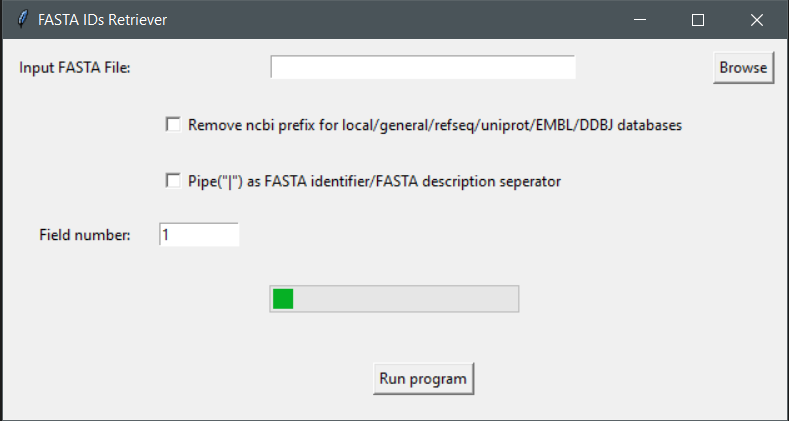

# FASTA IDs Retriever

A fast lightweight Windows GUI app that retrieves Identifiers from an imput fasta file

## Dependencies

1. Windows 11 or 10 version 16215.0 or higher(type `winver` on the search button and click `winver` to find your OS version)
2. [Windows Subsystem for linux(wsl1)](INSTALL.md)
3. the file in the `bin` folder

## Usage 

Click on the `FASTA IDs Retriever.exe` file

Click `browse` and select an input file

Select whether or not you want to remove the ncbi/refseq/uniprot prefixes `lcl|`, `gnl|`, `ref|`, `sp|`, `tr|`

Select whether or not pipe(`|`) is used as an FASTA identifier/description seperator.   
The default is space

Click `Run program`

The example input/output files can be seen [here](data/)

Input file for `example 1` was downloaded from solgenomics.net tomato annotation version 4.1.

Input file for `example 2` was downloaded from ncbi.

Input file for `example 3` was downloaded from lotus base(MG20 v3.0 proteins file).

**NOTE: This program also retrieves FASTA identifiers when no FASTA descriptions exist**  
